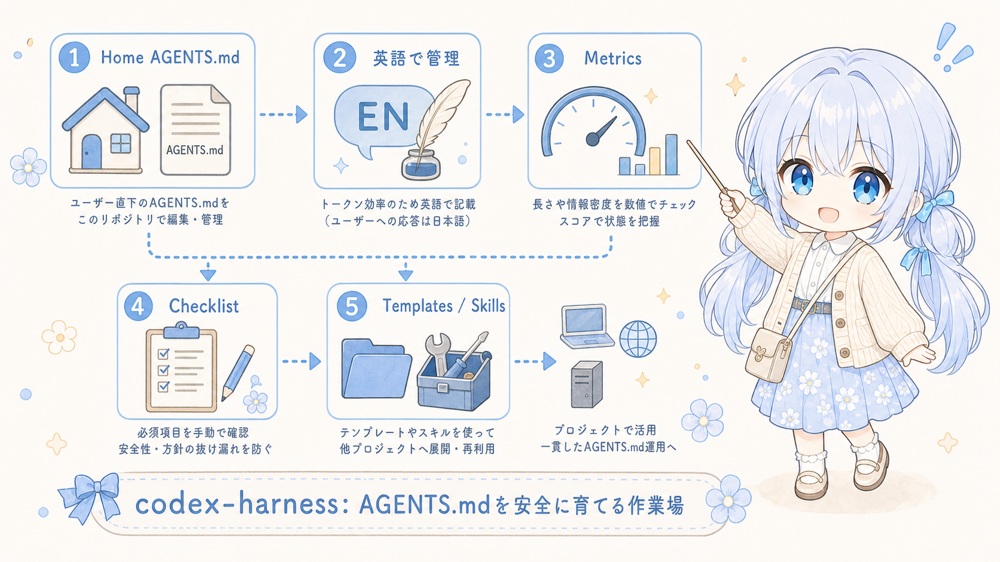

# codex-harness

ユーザー直下の `AGENTS.md` を安全に育てるためのハーネスリポジトリです。

このリポジトリは、home-level `AGENTS.md` の正本候補である `AGENTSExample.md`、手動チェックリスト、情報密度を測るmetrics scriptを管理します。プロジェクト別テンプレート配布や汎用skill管理はMVPの対象外です。

このハーネスの目的は高得点を目指すことではありません。`AGENTSExample.md` や周辺運用が著しく悪化した時に気づける最低限の床を作り、低scoreや警告を改善判断の入口として使うことを目的にします。



MVPではユーザー直下の `AGENTS.md` を自動上書きしません。反映前に内容を確認し、必要な差分だけを手動で取り込む運用を前提にします。

## Instruction Language Policy

ユーザー直下に置く想定の `AGENTS.md` の候補である `AGENTSExample.md` は、token消費を少しでも抑えるためEnglishで記載します。

ただし、これはinstruction fileの記述言語の方針です。Codexのユーザーへの通常応答は、`AGENTSExample.md` 内で明示する通り日本語を基本にします。

## Directory Structure

```text
codex-harness/
├─ README.md
├─ AGENTS.md
├─ AGENTSExample.md
├─ benchmarks/
│  ├─ AGENTS.checklist.md
│  └─ HARNESS.checklist.md
├─ img/
│  └─ codex-harness.png
└─ scripts/
   ├─ evaluate-agents.ps1
   ├─ measure-agents.ps1
   └─ validate-harness.ps1
```

## Usage

### 1. `AGENTSExample.md` を調整する

リポジトリ直下の `AGENTSExample.md` を、ユーザー直下に置くhome-level agent instructionsの正本候補として編集します。root `AGENTS.md` はこのハーネスrepo自体の作業指示として使います。

実装前には、追加・変更するruleがglobal instructionsに入れるべきものか、repo `AGENTS.md` に留めるべきものか、Skillに分離すべきものかを確認します。

### 2. metricsを確認する

長さや情報密度の目安を数値で確認する場合は、`scripts/measure-agents.ps1` を実行します。

```powershell
.\scripts\measure-agents.ps1 -Path .\AGENTSExample.md
```

このscriptは以下の観点から `0-100` の簡易スコアを出します。

- 非空行数
- 文字数
- 日本語文字の割合
- section数
- bullet数
- 140文字を超える行数
- 必須観点のcoverage

スコアは品質保証ではなく、情報を詰め込みすぎていないかを見るための目安です。

### 3. harness scoreを確認する

`scripts/evaluate-agents.ps1` は、home-level `AGENTS.md` の候補である `AGENTSExample.md` を「常時読み込む設定ファイル」として管理するための評価を出します。

```powershell
.\scripts\evaluate-agents.ps1 -Path .\AGENTSExample.md
```

このscriptは以下の観点から `0-100` の目安スコア、警告、改善提案、分類を出します。

- Token Efficiency
- Clarity
- Actionability
- Global Relevance
- Duplication
- Conflict Risk
- Separation Fitness

分類は以下の候補を出します。

- Keep in global AGENTS.md
- Move to repo AGENTS.md
- Move to Skill
- Merge with similar rule
- Rewrite for clarity
- Remove

編集前後を比較する場合は `-BeforePath` と `-AfterPath` を指定します。

```powershell
.\scripts\evaluate-agents.ps1 -BeforePath .\AGENTSExample.before.md -AfterPath .\AGENTSExample.md
```

この評価は絶対的な品質判定ではありません。誤検知を許容し、`AGENTSExample.md` を肥大化させずに改善するための判断材料として使います。特にscoreが低い場合や警告が増えた場合に、分離・重複・欠落を確認する警告灯として扱います。

### 4. checklistで確認する

`benchmarks/AGENTS.checklist.md` を使い、`AGENTSExample.md` が必要な運用観点を満たしているか手動で確認します。

評価は `Pass / Needs Review / Fail` と短いメモで記録します。自動評価で警告された項目は、手動チェックで残す・移す・削る判断を確認します。

### 5. harness自体を確認する

`scripts/validate-harness.ps1` は、このリポジトリが最低限のハーネスとして壊れていないかを確認します。

```powershell
.\scripts\validate-harness.ps1 -Path .\AGENTSExample.md
```

このscriptは、主要ファイルの存在、READMEの説明、既存評価scriptの最低score floorを確認します。高得点を保証するものではなく、明らかな欠落や低scoreを検出するための簡易チェックです。

手動では `benchmarks/HARNESS.checklist.md` を使い、README、scripts、checklists、MVP境界が互いにずれていないかを確認します。

## Public Safety Notes

public repositoryとして公開する前に、少なくとも以下を確認します。

- API keyやtokenを含めない。
- `.env` や実環境用configを含めない。
- 個人メールアドレスや個人パスを含めない。
- 内部IPアドレスや内部ネットワーク構成を不用意に書かない。
- READMEに実環境の詳細を書きすぎない。
- 画像や素材は公開利用できるものだけを含める。
- commit historyに機密情報が残っていないか確認する。

## Future Ideas

- LLM reviewを併用したscripted benchmarkの拡張
- prompt task benchmark
- ユーザー直下 `AGENTS.md` への安全な同期script
- GitHub Actionsでのpublic安全チェック
- private用とpublic用の設定分離
