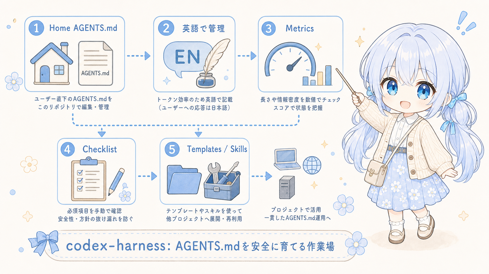

# Codex-Harness

ユーザー直下の `AGENTS.md` を安全に編集・検証するためのハーネスです。[AGENTSExample.md](AGENTSExample.md) をグローバル指示の正本候補として管理します。

評価の目的は、指示や運用の著しい劣化に気づくための最低限の確認です。静的スコアと警告を判断材料にし、実際のモデルの行動は別に確認します。



## 指示と文書の配置

| 配置先 | 記載する内容 |
| --- | --- |
| [AGENTSExample.md](AGENTSExample.md) | 複数のリポジトリや種類の異なる作業に適用するグローバル指示の候補 |
| [AGENTS.md](AGENTS.md) | このハーネス固有の作業・検証ルール |
| Skill | 常時読み込む必要のない、特定の作業に関する詳細手順 |
| READMEと既存のチェックリスト | 利用方法、評価方法、判断に必要な制約 |

指示を編集する前に配置先を確認します。本文と見出しは日本語で記載し、コード、コマンド、パス、API名、JSONキーなどの識別子は元の表記を維持します。ファイル名は既存の規則を優先するため、このリポジトリの `README.md` や `AGENTSExample.md` は変更しません。

共通の作業ルールは候補ファイルに集約します。ファイル名、文書運用、Git操作、安全性などの詳細は [AGENTSExample.md](AGENTSExample.md) を参照してください。一時的な計画・調査結果・完了報告はチャットで共有し、恒久的に必要な説明は関連する既存文書へ統合します。

## 編集から反映まで

1. 適用される指示と今回の対象を読み、配置先を確認して `AGENTSExample.md` を編集します。単純な文言修正を超える変更では、意図する動作と副作用も確認します。
2. 以下の静的評価を実行し、警告されたルールを手動で確認します。変更内容に応じてハーネスの検証と行動評価も行います。
3. 候補の「Git操作」に従い、依頼範囲の変更だけを作業用ブランチでcommitします。条件を満たすpush・mergeは自動で進め、条件外の操作は理由と検証結果をまとめて確認します。
4. ユーザーがグローバル指示への反映を承認した場合に、使用中の `AGENTS.md` へ対象の差分を反映します。リポジトリへのcommit・push・mergeと、使用中の指示への反映は別の操作です。

このリポジトリにはグローバル指示を自動同期するスクリプトはありません。反映時は、既存のPC固有の設定と今回の対象外のルールを保持し、反映後の内容を確認します。承認済みの反映を再確認する必要はありません。

ダッシュボード記録ルールの `<dashboard-cli-path>` は公開用のプレースホルダーです。グローバル指示に反映するときは、そのPCで設定済みの `state_cli.py` のパスに置き換えます。実パスや認証情報、個人情報をリポジトリへ取り込まないでください。

## 静的評価と手動確認

PowerShellでリポジトリのルートから実行します。追加のライブラリやAPI keyは不要です。

```powershell
.\scripts\measure-agents.ps1 -Path .\AGENTSExample.md
.\scripts\evaluate-agents.ps1 -Path .\AGENTSExample.md
```

| スクリプト | 確認する内容 |
| --- | --- |
| `measure-agents.ps1` | 非空行数、文字数、UTF-8 byte数、見出し数、箇条書き数、必須観点の網羅性による分量の目安 |
| `evaluate-agents.ps1` | Context Economy、Clarity、Actionability、Global Relevance、Duplication、Conflict Risk、Separation Fitness、Autonomy Calibrationの8観点による内容の目安 |

いずれも0–100の簡易スコアです。日本語文字の割合と140文字を超える行数は参考値であり、減点には使いません。短さや見出しの少なさだけでも減点しません。文字数や言語の割合から実際のtoken数や指示遵守率を判断しないでください。

内容評価は日本語・英語のキーワードによる静的判定です。実行可能な表現、無条件の制約、曖昧な指示、配置先、矛盾の候補を検出しますが、言い換えを網羅しません。Gitの承認条件に公開・リリースが含まれるだけではSkillへの移動候補にしません。重複判定は空白・大文字小文字・末尾の句点を正規化した同一ルールに限定するため、意味の重複や条件付きルールの矛盾も手動で確認します。

分類結果は、グローバルに残す、リポジトリへ移す、Skillへ移す、統合する、明確化する、削除する、の判断材料です。[AGENTS.checklist.md](benchmarks/AGENTS.checklist.md) で `Pass / Needs Review / Fail` として確認します。

JSON出力は `-AsJson`、別のモデル確認記録は `-ProfilePath` で指定できます。

```powershell
.\scripts\evaluate-agents.ps1 -Path .\AGENTSExample.md -AsJson
```

編集前後の比較には `-BeforePath` と `-AfterPath` を使います。変更前のファイルは一時ディレクトリへ保存し、作業報告用のMarkdownを追加しません。

```powershell
$beforePath = Join-Path $env:TEMP 'codex-harness-before.txt'
git show HEAD:AGENTSExample.md | Set-Content -LiteralPath $beforePath -Encoding UTF8
.\scripts\evaluate-agents.ps1 -BeforePath $beforePath -AfterPath .\AGENTSExample.md
```

変更前後は同じ評価基準で再評価します。旧バージョンで保存したスコアと直接比較しないでください。

## ハーネスの検証

構成、スクリプト、必須ファイルを変更した場合は、以下を実行します。[HARNESS.checklist.md](benchmarks/HARNESS.checklist.md) で文書と検証手順の整合性も確認します。

```powershell
.\scripts\validate-harness.ps1 -Path .\AGENTSExample.md
```

主要ファイル、READMEの説明、モデル確認記録の有効性と確認期限、評価スクリプトの正常終了を検査します。分量評価と内容評価の最低基準は、それぞれ既定で70点です。`-SkipScriptRuns` でも確認期限を検査します。

必要なルールを保持すると分量評価が基準を下回ることがあります。検証失敗を隠したり点数のためだけにルールを削ったりせず、原因と内容評価を確認します。検証例外を使う場合は理由とユーザーの承認範囲を確認し、既定の検証が成功したとは報告しません。最低基準を明示して再検証する場合は `-MinimumMetricsScore` と `-MinimumHarnessScore` を使用します。

評価スクリプトやモデル確認記録の検証処理を変更した場合は、回帰テストも実行します。成功済みの検証は、新たな変更・失敗・未解決の懸念がある場合だけ追加または再実行します。

```powershell
.\scripts\test-harness.ps1
powershell.exe -NoProfile -ExecutionPolicy Bypass -File .\scripts\test-harness.ps1
```

スクリプトは日本語の正規表現や検証データを扱うため、Windows PowerShell 5.1でも読めるUTF-8 BOM付きで保存します。回帰テストはPowerShell 7と5.1で確認できます。

## モデルと公式資料の確認

対象モデル、行動評価のreasoning effort、公式資料、資料が裏付ける範囲、確認日、再確認間隔は [model-profile.json](benchmarks/model-profile.json) で管理します。モデルの選択やCodexアプリの設定を書き換える機能はありません。

再確認間隔はこのリポジトリの運用値として30日です。期限到達時とモデル・Codexの仕様変更時に、公式資料と評価の前提を確認して記録を更新します。日付だけを更新しないでください。期限到達、未来の日付、不正な記録はハーネスの検証で失敗として報告します。

GPT-6ガイドの行動特性の説明は主にAstraの観測に基づくため、Solでの効果は行動評価で確認します。AGENTS.mdの既定の32 KiBは読み込む指示全体の上限で、モデルのcontext windowとは別です。

静的評価はモデルを呼び出さず、公式資料も毎回取得しません。確認期限内でも外部仕様の変更を自動検知する保証はありません。

## モデルの行動評価

[AGENTS.checklist.md](benchmarks/AGENTS.checklist.md) の `GPT-6 Sol Behavior Cases` を、モデル確認記録の比較条件で実施します。対象モデル、reasoning effort、読み込まれた指示、権限、実際の操作、確認要求、検証範囲、最終成果を記録します。

指示変更後やモデル変更後は同じケースで、依頼を完了できたか、不要な確認・読み込み・テストが増えたか、既存変更を保護できたかを比較します。使い捨ての検証用リポジトリを使用し、外部へのpush・PRマージ・公開・デプロイのケースはコマンドの提案と確認判断までを観察します。

実施していないケースは `Not run` のままにします。静的チェックの成功を行動評価の `Pass` として転記しないでください。

## リポジトリ構成

```text
Codex-Harness/
├─ README.md
├─ AGENTS.md
├─ AGENTSExample.md
├─ benchmarks/
│  ├─ AGENTS.checklist.md
│  ├─ HARNESS.checklist.md
│  └─ model-profile.json
├─ img/
│  └─ codex-harness.png
└─ scripts/
   ├─ evaluate-agents.ps1
   ├─ harness-profile.ps1
   ├─ measure-agents.ps1
   ├─ test-harness.ps1
   └─ validate-harness.ps1
```
